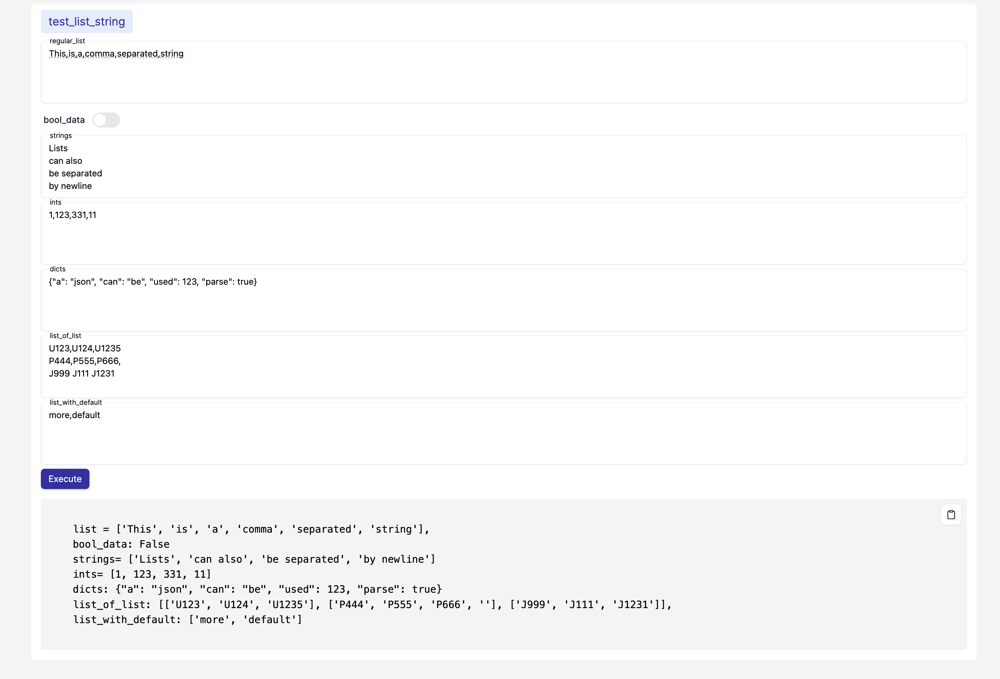

<p align="center">
  <h1 align="center">Python UI-Me</h1>
  <p align="center">A simple python decorator, to build UI forms out of your everyday python functions<p>
  <p align="center">
    <a href="https://pypi.org/project/python-uime">
    	
    </a>
    <a href="https://github.com/livetheoogway/python-uime/blob/master/LICENSE">
    	
    </a></p>
</p>

## UI-Me

Python UI-Me (as in: Python methods saying "make elegant UI forms out of me") is a Python package that enables
developers to quickly create web-based user interfaces for Python functions. It uses decorators to mark functions for UI
exposure and a built-in Flask server to render the UI.

## TL;DR

**The promise:** With-in 3 lines of code, you will be able to get a working UI form out of your python functions<br>
**Another promise:** You won't regret the time spent in reading the [Motivation](#Motivation) section, it is not too
long<br>
But for the ones seeking instant gratification: watch this fancy gif (which I totally struggled to create):<br>


## Motivation

I'm pretty sure I'm not the only lazy developer that over-engineers every small daily task as scripts. <br>
Honestly, this is yet another attempt of the aforementioned over-engineering, towards making it as easy as possible to
whip up a quick UI to run those scripts.<br>
Yes, there are good alternatives, `argparse` being a popular one for running your scripts through cli. But I've always
struggled with it the moment the script has multiple functionalities or modules.
The day you start forgetting your engineering principles and start overloading your one script to do many things (
because duh! that was the whole point of writing it as a script), these cli tools start to fall apart.  
Not the mention the amount of code you'd have to write, like stitching parsers and subparsers and subsubparsers
and.. <br>

Having said that, for proper production scripts, UI-me is not the way to go. But for those quick and dirty daily /
personal scripts, you would find UI-me useful <br>
Think of this like [Swagger UI](https://swagger.io/tools/swagger-ui/), but for python functions. <br>

## Features

1. **Easy Function Exposure** <br>
   Decorate Python functions with `@ui_enabled` to expose them as web forms.
2. **Automatic UI Generation** <br>
   Generates web UIs for decorated functions, with form fields corresponding to function parameters.
3. **Grouping of Functions** <br>
   Organize functions into <br>
   groups (nav-tabs) in the UI for better organization.
4. **Customizable Function Metadata** <br>
   Specify titles, descriptions, and other metadata for functions.
5. **Built-in Web Server** <br>
   Comes with an integrated Flask web server to host the UI.
6. **Clipboard Support** <br>
   Easy copy-to-clipboard feature for function outputs.
7. **Quick navigation Sidebar** <br>
   If you have too many functions, the sidebar can be used to quickly navigate to your function
8. **Global Variables** <br>
   Set global variables for your script, from within the UI.
9. **Type Inferring (This is Cool !!)** <br>
   Functions that contain arguments with types, are inferred and rendered accordingly in the INPUT form

## Installation

Install Python UI-me using pip:

```bash
python3 -m pip install python-uime
```

## Usage

Basically 3 lines of code

```python
from uime import start_server, ui_enabled  ## <--- This is line 1


##  Below is line 2
@ui_enabled(group="Greeting", description="This function will greet you (with positivity!)")
def hello_world(name):
    return f"Hello {name}"


@ui_enabled(group="Greeting", title="My Test Function with Nice Title",
            description="This function will return a json (So that you can see it is nicely printed)")
def make_api_call(url, data):
    return json.dumps({"url": url, "data": hello_world(data)})


@ui_enabled(group="Maths", description="This will return a + b")
def sum_math_function(a, b):
    return a + b


@ui_enabled(group="Maths")
def difference_math_function(a, b):
    return a - b


if __name__ == '__main__':
    start_server()  ## <--- This is line 3 (As promised, within 3 lines of code)
```


## Advanced Usage

### 1. Setting Global Variables

You might run into situations where you want to set global variables of your script. <br>
This is going to be a little more involved - you need to expose a setter to the global variable, while using a new
decorator `@ui_global` <br>
Here is an example:

```python
from uime import start_server, ui_enabled, ui_global  ## <--- ui_global is the new import

DEFAULT = "There are no accidents."
DEFAULT_2 = "Only coincidences."


@ui_global(name="DEFAULT", description="Global DEFAULT value", default_value=DEFAULT)
def set_default(value):
    global DEFAULT
    DEFAULT = value


@ui_global(name="DEFAULT_2", description="Global DEFAULT_2 value", default_value=DEFAULT_2)
def set_default2(value):
    global DEFAULT_2
    DEFAULT_2 = value


@ui_enabled(group="group1")
def hello_world(name):
    return f"Hello {name}. {DEFAULT} {DEFAULT_2}"  # <-- using the global variables
```

The left navigation bar contains a section for Global Variables, which will allow you to set them. <br>

### 2. Function Parameter Type Inferring

| type          | form input   | type inferred          |
|---------------|--------------|------------------------|
| nothing       | text input   | str                    |
| str           | text input   | str                    |
| bool          | switch       | bool                   |
| int           | number input | int                    |
| float         | number input | float                  |
| complex       | number input | complex                |
| list          | text area    | list of string         |
| set           | text area    | set of string          |
| type          | text area    | list of string         |
| List[str]     | text area    | list of string         |
| List[int]     | text area    | list of int            |
| List[float]   | text area    | list of float          |
| List[complex] | text area    | list of complex        |
| List[list]    | text area    | list of list of string |
| dict          | text area    | json to dict           |

Sample code below shows a list of parameters that have different types:

```python
from typing import List
import json
from uime import start_server, ui_enabled


@ui_enabled(group="group1")
def test_list_string(regular_list: list, strings: List[str], ints: List[int], dicts: dict, list_of_list: List[list]):
    return f"""
    list = {regular_list}
    strings= {strings}
    ints= {ints}
    dicts: {json.dumps(dicts)}
    list_of_list: {list_of_list}
    """

```

The UI would look something like this


> [!NOTE]
> As you observe the above table, a text-area is used to collect inputs for complex datatypes. This is being done on
> purpose to keep things simple, but that simplicity comes at a cost.
> When inferring a list of anything from the text-area - extraction of the list from the large string, is done by using
> delimiters.
> By default, the priority of delimiters are NEWLINE, COMMA, SPACE
> ie: NEWLINE is checked first, if available, the string will be split by newline and returned as a list. Then there is a
> check for COMMA, if available, the string will be split by comma and returned as a list. Finally SPACE.
> In case of <list of list>, it is always a check on NEWLINE for the outer list, and COMMA/SPACE for the inner lists

## Dependencies

The following is not the exhaustive list of dependencies, but UI-me was made possible because of these:

- [Flask](https://flask.palletsprojects.com/en/3.0.x/): quickest way to spin up a web server
- [Jinja2](https://jinja.palletsprojects.com/en/2.11.x/templates/): for templating
- [Tailwind CSS](https://tailwindcss.com/): it is a pretty neat, utility-first CSS framework for rapid UI development

## Features Pending

- [ ] Handle overloading of functions (identify functions with ids rather than names)
- [x] Add support for setting `global` variables in the UI ([Setting Global Variables](#1-setting-global-variables))
- [x] Add support for complex data-structures as inputs (like list of strings, or json strings)
- [x] Make default values for parameters as non-mandatory in the form
- [x] Capture parameter data types and change the form field type accordingly

## Contributions

Please raise Issues, Bugs or any feature requests
at [Github Issues](https://github.com/livetheoogway/python-uime/issues). <br>
If you plan on contributing to the code, fork the repository and raise a Pull Request back here.
